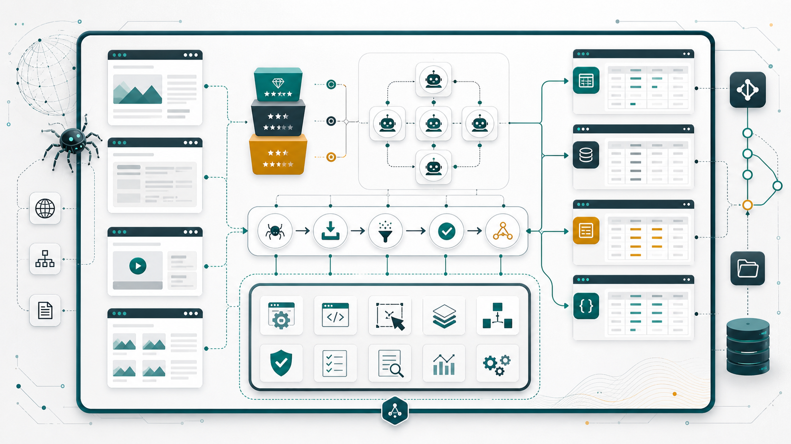

# Scraping Agent Workspace Scaffold



[中文说明](README.md)

Scraping Agent Workspace Scaffold is a workspace template for structured data collection projects. It helps users define field semantics, source priority, folder boundaries, quality grading, and delivery checks before writing crawlers. The repository combines a governance layer for data projects with a reusable scaffold for creating target-specific scraping workspaces.

This project is designed for teams that use agents or automation workflows to collect, validate, clean, and deliver data from multiple channels. Instead of treating scraping as a single script, it treats scraping as a managed data project with traceable sources, reviewable assumptions, and repeatable handoff rules.

In one real data project for 2023 ecological indicators across Hebei cities, a conventional crawler workflow reached about 21% completion. After moving the work into this scaffold and using variable modeling, source grading, archived raw materials, fill-audit records, and stable handoff rules, the main table reached 98/143 filled cells, or 68.53% completion, roughly 69%.

## Who This Is For

- Researchers, analysts, and automation engineers who manage multiple data collection targets.
- Teams that want agents to follow a fixed workflow for field confirmation, channel dispatch, scraping, cleaning, and delivery.
- Projects that need source links, quality grades, collection timestamps, and verification status.
- Workflows that combine web scraping, document extraction, spreadsheet delivery, and progress tracking.
- Users who want a GitHub-ready template for repeatable data acquisition projects.

## Core Ideas

### Model First, Scrape Later

The first step of a data collection project is not writing a crawler. It is defining the variables. A variable confirmation table should include field name, meaning, unit, data type, source priority, required status, cleaning rule, acceptable missing condition, and notes. Crawling starts only after the field scope is clear.

### Governance and Execution Are Separate

Workspace governance lives in [AGENTS.md](AGENTS.md). It defines the rules for folder layout, Git checkpoints, backups, environment files, progress records, source grading, and delivery checks.

Executable workflow guidance lives in [scaffolding/tools/workspace-scraping/SKILL.md](scaffolding/tools/workspace-scraping/SKILL.md). It turns the governance rules into concrete actions: creating target projects, generating variable tables, dispatching channel subagents, selecting scraping tools, organizing raw files, and validating deliverables.

### Task Ledger Prevents Duplicate Crawls

Each target project includes `doc/任务清单.md`, a task ledger for subagents, source grade, variable, target URL or file, dedupe key, status, output location, and failure notes. Before dispatch, the agent checks the ledger. Completed and reusable pages are not crawled again; failed or review-needed pages keep their retry reason.

### Prompt Template Injection

Subagent dispatch uses [subagent-prompt-templates.md](scaffolding/tools/workspace-scraping/references/subagent-prompt-templates.md). Official source, official news, third-party news, literature extraction, reverse calculation, weak-source verification, and aggregation each have a dedicated template. The dispatcher injects the matching template by task goal and source grade instead of mixing different source levels into one vague prompt.

### Scrapling Is the Primary Scraping Path

`Scrapling` is the default web scraping library for this workspace. The scaffold includes Scrapling-focused examples and skill guidance. Escalation should follow the target's complexity:

1. `Fetcher` for static pages.
2. `DynamicFetcher` for JavaScript-rendered pages.
3. `StealthyFetcher` only when the target requires stealth behavior.
4. `Spider` for pagination, concurrency, checkpoints, resume behavior, or larger crawls.

## Repository Layout

```text
.
├─ AGENTS.md
├─ README.md
├─ README.en.md
├─ .env.example
├─ .gitignore
├─ doc/
│  ├─ 项目地图.md
│  ├─ 进展记录.md
│  └─ assets/
│     └─ cover.png
├─ scaffolding/
│  ├─ README.md
│  ├─ AGENTS.md
│  ├─ examples/
│  ├─ templates/
│  ├─ tests/
│  └─ tools/
│     ├─ scripts/
│     ├─ skills/
│     └─ workspace-scraping/
├─ target-project-a/
├─ target-project-b/
└─ try/
```

## Root Workspace Responsibilities

| Path | Purpose |
| --- | --- |
| `AGENTS.md` | Main workspace governance rules |
| `README.md` | Chinese user-facing introduction |
| `README.en.md` | English user-facing introduction |
| `doc/项目地图.md` | Long-term project map and maintenance index |
| `doc/进展记录.md` | Progress record placeholder; can stay empty in the published template |
| `.env.example` | Environment variable example ledger with placeholders only |
| `.gitignore` | Ignores secrets, caches, and local temporary files |
| `scaffolding/` | Reusable scaffold capability directory |
| `try/` | Temporary validation directory; only an empty placeholder is committed |
| `target-project/` | A user's independent data collection target |

## Scaffold Responsibilities

| Path | Purpose |
| --- | --- |
| `scaffolding/tools/workspace-scraping/SKILL.md` | Concrete scraping workspace workflow |
| `scaffolding/tools/scripts/` | Scripts for project creation, variable table creation, and validation |
| `scaffolding/tools/skills/` | Bundled skill directories, committed as real files |
| `scaffolding/templates/standard-scraping-project/` | Standard target-project template |
| `scaffolding/examples/` | Scrapling examples |
| `scaffolding/tests/` | Scaffold structure tests |
| `scaffolding/.github/workflows/` | GitHub Actions validation template |

## Quick Start

### 1. Clone

```powershell
git clone https://github.com/q2955161835-debug/Scraping-Agent-Workspace-Scaffold.git
cd Scraping-Agent-Workspace-Scaffold
```

### 2. Install Dependencies

Enter the scaffold directory and install development plus scraping dependencies:

```powershell
cd .\scaffolding
python -m pip install -e .[dev,scraping]
```

For structure checks only:

```powershell
python -m pip install -e .[dev]
```

### 3. Validate the Scaffold

```powershell
python tools\scripts\validate_workspace.py .
.\tools\scripts\Test-ScrapingWorkspace.ps1
python -m pytest
```

### 4. Create a Target Project

From inside `scaffolding/`, create a target project in the parent workspace root:

```powershell
python tools\scripts\scaffold_project.py "Example Target Data" --root ..
```

PowerShell version:

```powershell
.\tools\scripts\New-ScrapingProject.ps1 -Name "Example Target Data" -Root ..
```

### 5. Create a Variable Confirmation Table

```powershell
python tools\scripts\create_variable_template.py "..\Example Target Data"
```

PowerShell version:

```powershell
.\tools\scripts\New-VariableTemplate.ps1 -ProjectPath "..\Example Target Data"
```

## Standard Workflow

1. Create a target project.
2. Build a variable confirmation table.
3. Confirm field names, meanings, units, types, source priorities, required status, cleaning rules, and acceptable missing conditions.
4. Create or update `doc/任务清单.md` with URLs, files, API endpoints, dedupe keys, statuses, and output locations.
5. Dispatch channel subagents by source type and inject the matching prompt template.
6. Collect data with Scrapling and supporting tools.
7. Store raw structured results in `原始数据/`.
8. Store downloaded files, snapshots, screenshots, reports, and PDFs in `原始文件/`.
9. Store temporary experiments in `try/`.
10. Clean, merge, deduplicate, and grade source quality.
11. Place the latest deliverable in the target project root.
12. Update project documentation as needed.

## Subagent Dispatch

Multi-source projects should split work across channel subagents: official source, official news, third-party news, literature extraction, reverse calculation, weak-source verification, and final aggregation. The detailed workflow is in [scaffolding/tools/workspace-scraping/references/channel-playbook.md](scaffolding/tools/workspace-scraping/references/channel-playbook.md).

The dispatch playbook covers:

- When multiple subagents are required.
- Required inputs before dispatch.
- Variable-to-channel mapping.
- Subagent prompt template injection.
- Task-ledger dedupe rules.
- Parallel execution and dependency rules.
- Source conflict resolution.
- Missing required field recovery.
- A subagent dispatch table template.

## Target Project Structure

Each top-level target directory should be an independent data collection project:

```text
target-project/
├─ doc/
├─ 旧数据/
├─ 原始数据/
├─ 原始文件/
└─ try/
```

| Directory | Purpose |
| --- | --- |
| `doc/` | Target documentation, variable notes, scraping strategy, and progress records |
| `doc/任务清单.md` | Task ledger for URLs, files, dedupe keys, statuses, output locations, and failures |
| `旧数据/` | Historical versions replaced by newer deliverables |
| `原始数据/` | Raw structured scraping results |
| `原始文件/` | Downloaded files, snapshots, screenshots, reports, and PDFs |
| `try/` | Test, debug, and temporary validation files |

Projects may add folders such as `清洗数据/`, `脚本/`, `截图证据/`, `中间结果/`, `配置/`, or `导出报告/`. New folders should be documented in the target project's `doc/项目地图.md` or `doc/目录说明.md`.

## Source Quality Grading

Source quality should be graded in this order:

```text
official > official news > third-party news > paper > reverse calculation > forum > other
```

Guidelines:

- Prefer the higher-quality source when multiple sources provide the same variable.
- Use low-quality sources only as clues, supplements, or anomaly investigation inputs.
- Reverse-calculated values must include formulas, input values, input sources, time range, unit conversion, and error risk.
- Final datasets should include source, quality grade, collection time, and verification status fields.

## Bundled Skills

`scaffolding/tools/skills/` contains real committed skill directories, not local symlinks.

| Skill | Purpose |
| --- | --- |
| `scrapling` | Scrapling strategy, dynamic pages, anti-bot handling, pagination, and Spider examples |
| `spreadsheets` | Excel templates, validation sheets, data cleanup, and workbook delivery |
| `markitdown-skill` | Convert documents, web pages, and office files to Markdown |
| `multi-search-engine` | Search strategy and auditable search URLs |
| `external-skills-hub` | External skill routing |
| `skill-creator` | Create and maintain skill files |

## Case Study

The Hebei 2023 ecological indicators project covered 11 prefecture-level cities and 13 ecological indicators. After migration into this scaffold, the project kept one root deliverable workbook, archived scripts and raw materials under stable folders, and preserved fill-audit records for later review. The main table improved from about 21% completion in a conventional crawler workflow to 98/143 filled cells, or 68.53%, roughly 69%.

## Acceptance Criteria

A target data project should satisfy at least:

- Variables have been confirmed.
- The task ledger records dedupe keys, statuses, output locations, and failure notes.
- Field sources are traceable.
- Source quality grades are present.
- The latest deliverable is in the target project root.
- Raw data and original files are archived.
- Target documentation records field semantics, folder extensions, scraping strategy, and exceptions.

Detailed acceptance guidance is available in [scaffolding/tools/workspace-scraping/references/dataset-acceptance.md](scaffolding/tools/workspace-scraping/references/dataset-acceptance.md).

## Environment Variables

- `.env` stores real sensitive configuration and must not be committed.
- `.env.example` stores only variable names, placeholders, sample values, and necessary notes.
- Do not put real keys, tokens, cookies, database passwords, or private endpoints in README files, progress records, or copyable code blocks.

## Published Template Notes

For a clean public repository:

- `doc/项目地图.md` can be published as the long-term project map.
- `doc/进展记录.md` can remain an empty file for users to start their own records.
- `try/` should only commit an empty placeholder; actual debugging files should stay local.

## License

This project uses the [MIT License](scaffolding/LICENSE).

